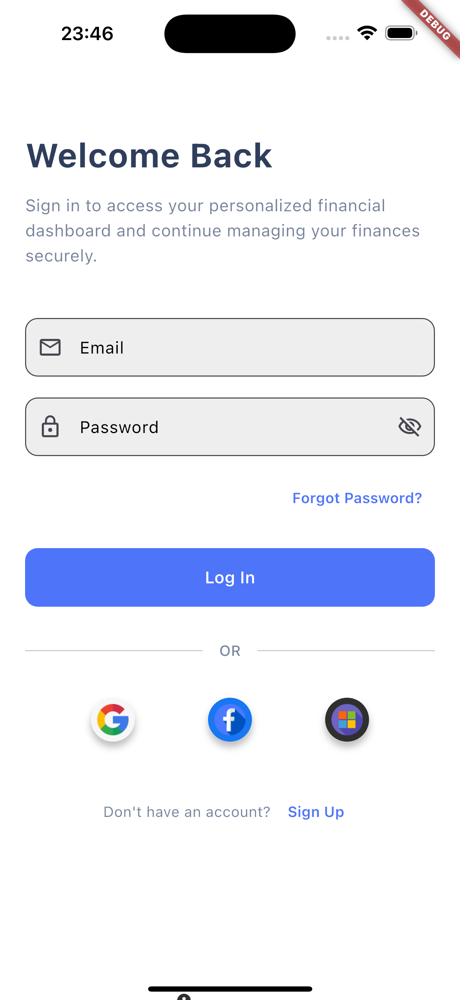
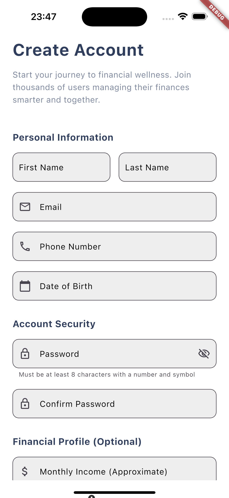
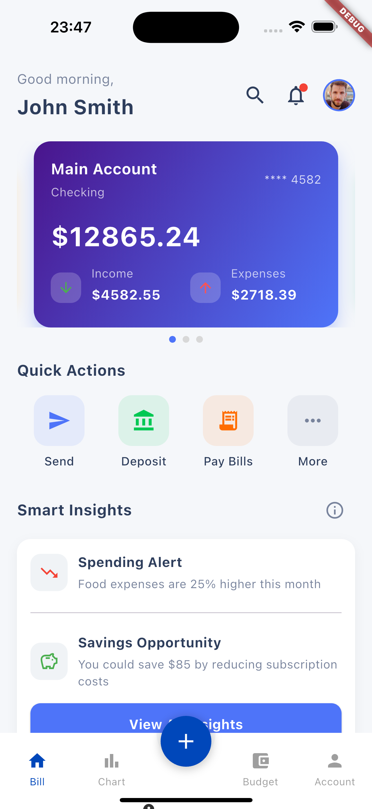
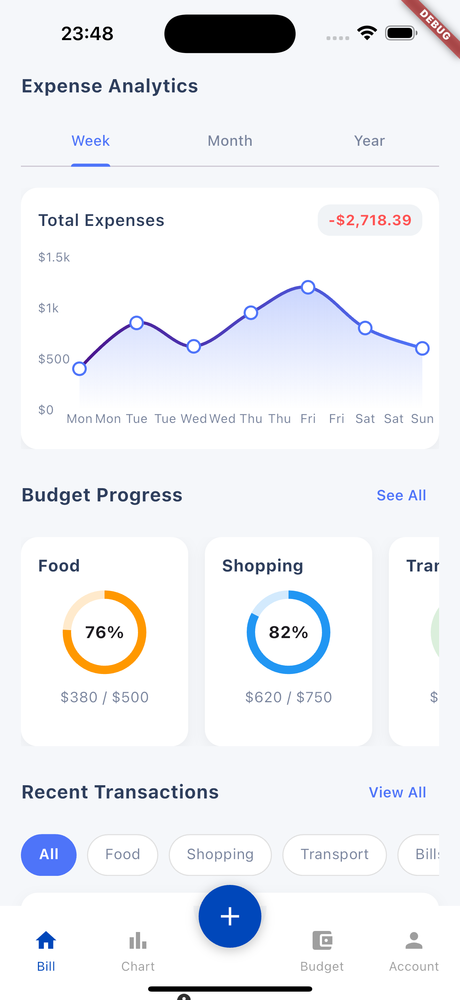
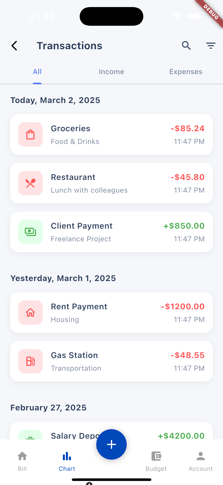
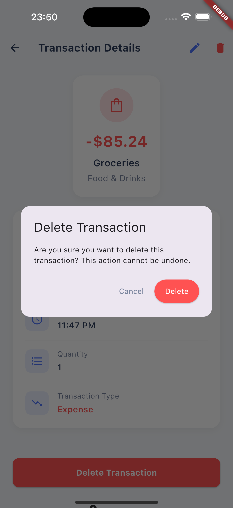
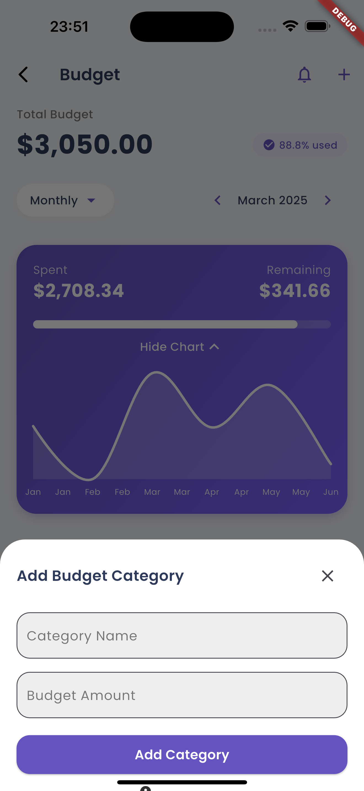
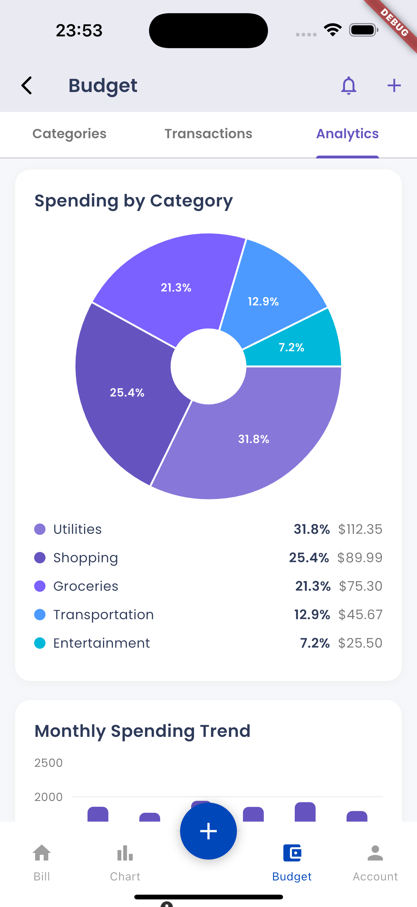

# Flutter Financial Management

Welcome to the Flutter Financial Management app! This app helps you manage your finances efficiently and effectively.

## Features

- Track your income and expenses
- Set budgets and savings goals
- Generate financial reports
- Secure and easy to use

## Screenshots

Here are some screenshots of the app:

  
  
  
  

  
  
  
  

  
  
  
  

## Getting Started

To get started with the Flutter Financial Management app, follow these steps:

1. Clone the repository
2. Install dependencies
3. Run the app

## Contributing

We welcome contributions! Please read our [contributing guidelines](CONTRIBUTING.md) for more information.

## License

This project is licensed under the MIT License - see the [LICENSE](LICENSE) file for details.
